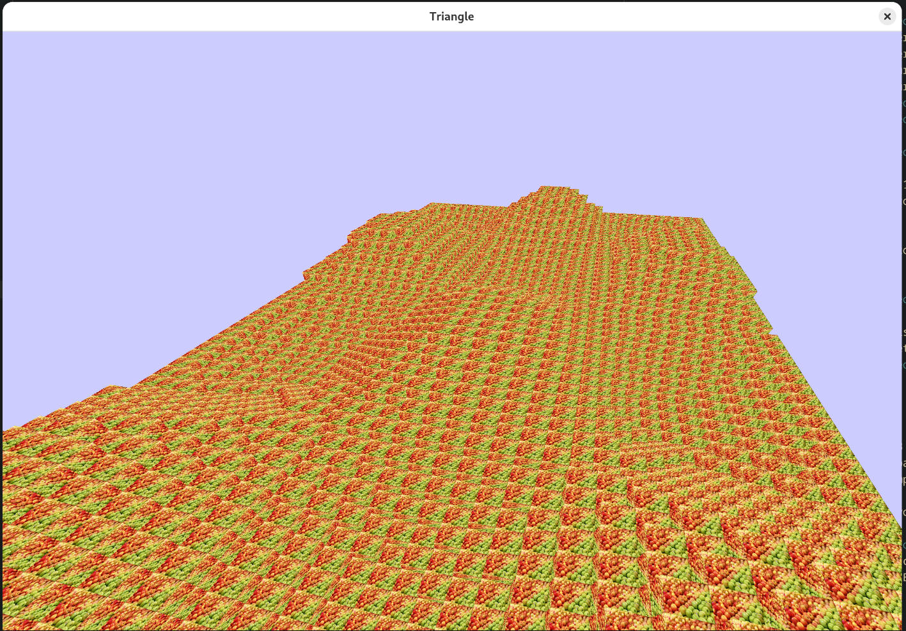

# Voxel Engine

This is a simple voxel rendering engine, inspired by games like Minecraft. 

# Running
## Linux
- Download the source code, including stb into the vendor folder.
- Ensure dependencies are installed `glew`, `sdl2`.
- Run `make run`.