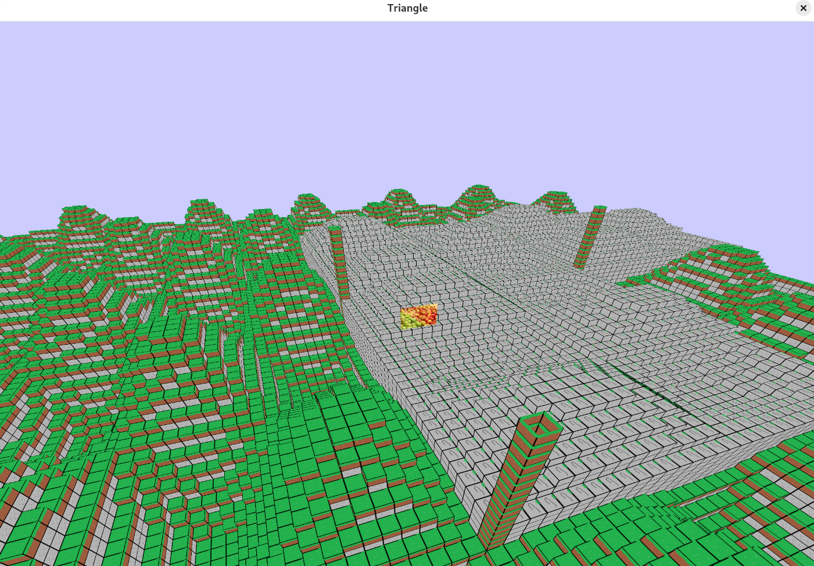

# Voxel Engine




This is my take on a multiplayer, voxel engine, game.

# License
Checkout [LICENSE](./LICENSE).

# Features
- Networking
- Multithreading
- Server
- Mesh Generation
- Dynamic Chunk Loader

# How to play?
1. Download your chosen release from the right pane of this page!(I recommend you pick the latest version, will have a .zip extension that is not source code)
2. Unzip the release zip file.
3. Enter the release directory.
4. Run the executable file depending on your operating system:

## Windows
1. Double Click the `voxelserver.exe` file in file explorer(you may have to press *More Info > run anyway*)
2. Double Click the `voxelclient.exe` file in file explorer(you may have to press *More Info > run anyway*)

## Linux
```bash
# Enter the build directory
sh bootstrap-linux.sh
```

5. Enjoy the work in progress!

# Bugs, Features Requests, & Issues
Open a new issue in the issues tab and write your feedback.